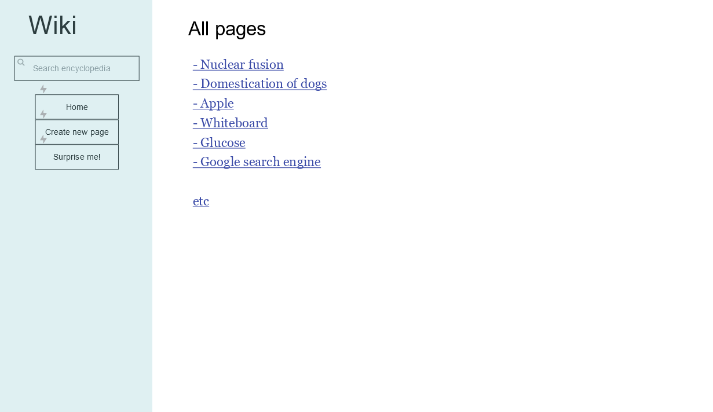
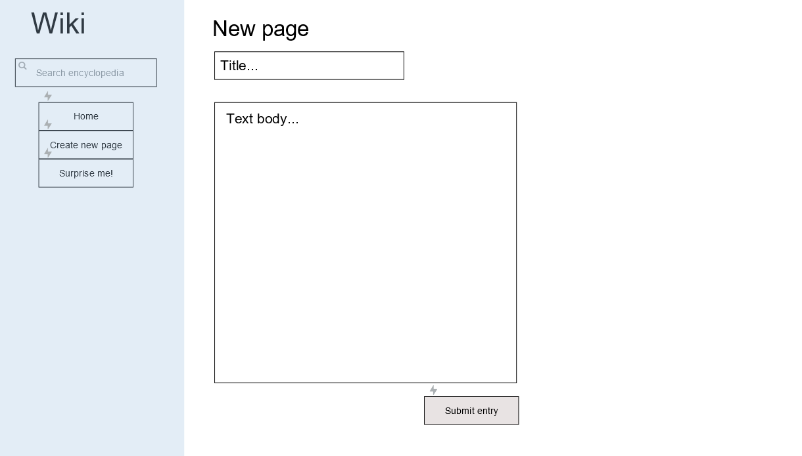
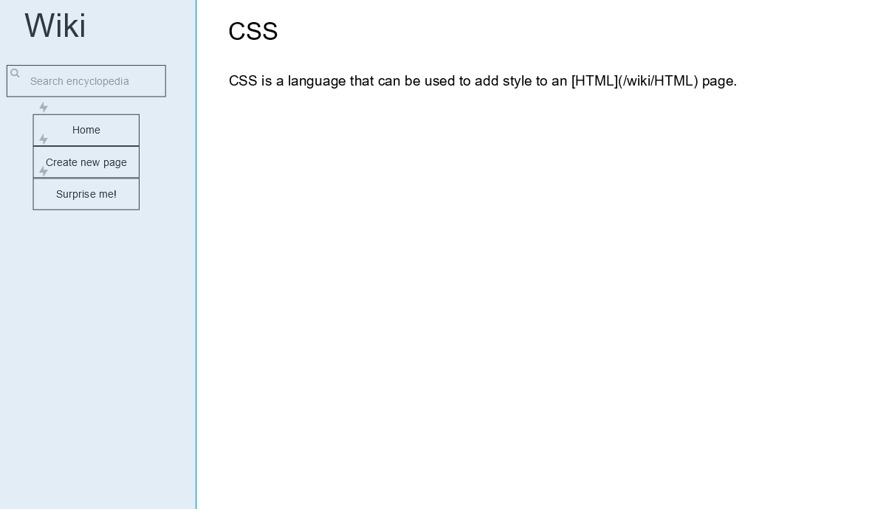

# Wiki Django application

For this problem, I will be making a web application whith similar features to Wikipedia.com.
Inside the web application, it will be possible to create new encyclopedia entries using the markdown language and for the user to read these pages.

The application will have features such as: a correctly working search bar,
a page where new wiki entries can be made and the capability to edit existing wiki entries. 

## To Do

First, I will have to create some sketches of what the web application will eventually look like. I will make these in the JustInMind application. Then, these sketches will have to be added to this readme file using the markdown language. 

Below you will find the sketches for the different pages in the web app.

